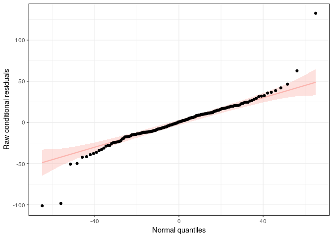

redres
======

`redres` is an R package developed to help with diagnosing linear mixed models fit using the function `lmer` from the lme4 package. This package both computes residuals types and creates plots that are not available from lme4.

Installation
------------

`redres` can be installed from the GitHub repository using the devtools package.

``` r
# Installs redres
devtools::install_github("goodekat/redres")
```

Once installed, the package can be loaded as usual.

``` r
# Loads the library
library(redres)
```

Functions
---------

The package contains the following functions.

#### redres

`redres` computes residuals given an `lmer` model and a specified residual type. The available residuals types are listed below.

-   `"genres"`: generalized residuals
-   `"pearson_cond"`: Pearson conditional residuals
-   `"pearson_mar"`: Pearson marginal residuals
-   `"raw_cond"`: raw conditional residuals (default)
-   `"raw_mar"`: raw marginal residuals
-   `"std_cond"`: studentized conditional residuals
-   `"std_mar"`: studentized marginal residuals

``` r
# fits an lmer model
library(lme4)
m <- lmer(Reaction ~ Days + (Days | Subject), data = sleepstudy)

# computes the default residuals (raw conditional)
rc_resids <- redres(m)

# computes the Pearson marginal residuals
pm_resids <- redres(m, type = "pearson_mar")

# computes the studentized conditional residuals
sc_resids <- redres(m, type = "std_cond")

# puts the residuals in a data frame and prints the first six rows
resids <- data.frame(rc_resids, pm_resids, sc_resids)
head(resids)
```

    ##    rc_resids   pm_resids  sc_resids
    ## 1  -4.102638 -0.05183946 -0.1827204
    ## 2 -14.624497 -0.08779115 -0.6273252
    ## 3 -42.195157 -0.57418908 -1.7645439
    ## 4   8.777483  0.97112562  0.3616111
    ## 5  24.523024  1.48696343  1.0048545
    ## 6  62.694664  2.39619943  2.5789296

#### plot\_resid

`plot_resid` creates a plot (using `ggplot2`) of the residuals versus the fitted values given a model and a specified residual type. All residuals types listed for `redres` work with `plot_resid` execpt `genres` since this type of plot is not meaningful for generalized residuals.

``` r
# creates a plot of the residuals versus fitted values
plot_redres(m, type = "std_cond")
```


#### plot\_genres

`plot_genres` (Kellie - want to fill in this section)

``` r
# creates a generalizaed residual quantile plot
plot_genres(m)
```



#### plot\_raneff

`plot_raneff`... (Kellie - want to fill in this section asl well)

``` r
# creates a normal quantile plot of the random effects
plot_raneff(m)
```


#### (shiny app function)

`(shiny app function)`...to be fillined in once available

Learn More
----------

To learn more about `redres`, see the package [vignette](https://goodekat.github.io/redres/articles/redres-vignette.html). This document contains information about...

-   how the residuals are computed
-   how the plots are created
-   how to appropriately use the different residual types
-   how to interpret the plots

Additionally, it contains an example using `redres` to assess the assumptions of a linear mixed model.
