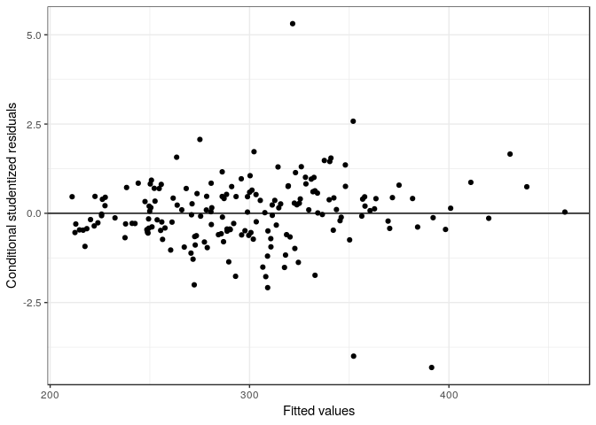
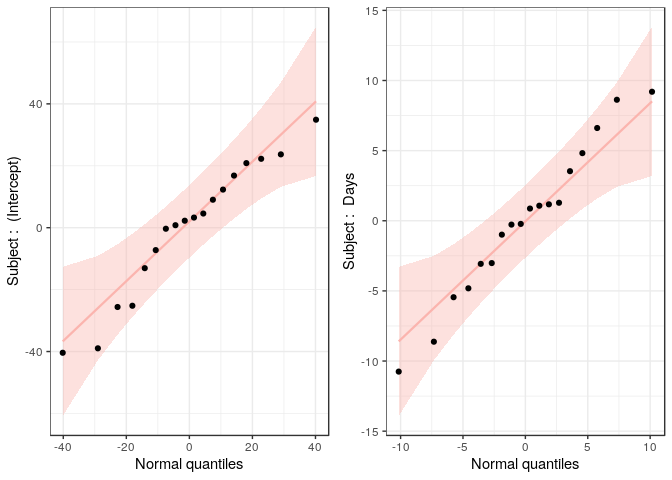

redres 
=================================================================================================

`redres` is an R package developed to help with diagnosing linear mixed models fit using the function `lmer` from the `lme4` package. It is meant to supplement the `lme4` package.

<!-- badges: start -->
[](https://travis-ci.org/goodekat/redres) [](https://codecov.io/gh/goodekat/redres?branch=master) <!-- badges: end -->

Installation
------------

`redres` can be installed from the GitHub repository using the devtools package.

``` r
# Installs redres
devtools::install_github("goodekat/redres")
```

Once installed, the package can be loaded as usual.

``` r
# Loads the library
library(redres)
```

Functions
---------

The package contains the following functions.

#### compute\_redres

`compute_redres` computes residuals given an `lmer` model and a specified residual type. The available residuals types are listed below.

-   `"pearson_cond"`: Pearson conditional residuals
-   `"pearson_mar"`: Pearson marginal residuals
-   `"raw_cond"`: raw conditional residuals (default)
-   `"raw_mar"`: raw marginal residuals
-   `"std_cond"`: studentized conditional residuals
-   `"std_mar"`: studentized marginal residuals

``` r
# fits an lmer model
library(lme4)
m <- lmer(Reaction ~ Days + (Days | Subject), data = sleepstudy)

# computes the default residuals (raw conditional)
rc_resids <- compute_redres(m)

# computes the Pearson marginal residuals
pm_resids <- compute_redres(m, type = "pearson_mar")

# computes the studentized conditional residuals
sc_resids <- compute_redres(m, type = "std_cond")

# puts the residuals in a data frame and prints the first six rows
resids <- data.frame(rc_resids, pm_resids, sc_resids)
head(resids)
```

    ##    rc_resids   pm_resids  sc_resids
    ## 1  -4.102638 -0.05183946 -0.1827204
    ## 2 -14.624497 -0.08779115 -0.6273252
    ## 3 -42.195157 -0.57418908 -1.7645439
    ## 4   8.777483  0.97112562  0.3616111
    ## 5  24.523024  1.48696343  1.0048545
    ## 6  62.694664  2.39619943  2.5789296

#### plot\_resid

`plot_resid` creates a plot (using `ggplot2`) of the residuals versus the fitted values given a model and a specified residual type. All residuals types listed for `redres` work with `plot_resid`.

``` r
# creates a plot of the conditional studentized residuals versus the fitted values
plot_redres(m, type = "std_cond")
```



#### plot\_resqq

`plot_resqq` creates a normal quantile plot (using `ggplot2` and `qqplotr`) of the raw conditional residuals, `raw_cond`. By the assumptions of a model fit using `lmer` these residuals are expected to be normally distributed. Obvious departures indicate an invalid assumption. See [vignette](https://goodekat.github.io/redres/articles/redres-vignette.html) for more details about interpreting quantile plots.

``` r
# creates a residual quantile plot for the error term
plot_resqq(m)
```


#### plot\_ranef

`plot_ranef` creates normal quantile plots for all random effects in the model. Under the assumptions of a `lmer` model, each random effect term is normally distributed. This function will return a grid of plots fit using `ggplot2` and `qqplotr`.

``` r
# creates normal quantile plots for each random effect
plot_ranef(m)
```



#### launch\_redres

`launch_redres` opens a Shiny app that includes interactive panels to view the diagnostic plots from a model. The function can be used by inputting one or two models into the app in the form of a vector. If two models are input, the residual plots will be shown side by side in the app. Screen shots of the app are shown below.

``` r
# opens the app
launch_redres(m)
```

 

Learn More
----------

To learn more about `redres`, read through the [vignette](https://goodekat.github.io/redres/articles/redres-vignette.html) for `redres` which contains:

-   details on how the residuals are computed
-   explanations of how to use the different residual types
-   interpretations of the plots
-   examples using `redres` to assess the assumptions of a linear mixed model

Additionally, more information is available at the package [website](https://goodekat.github.io/redres/).
